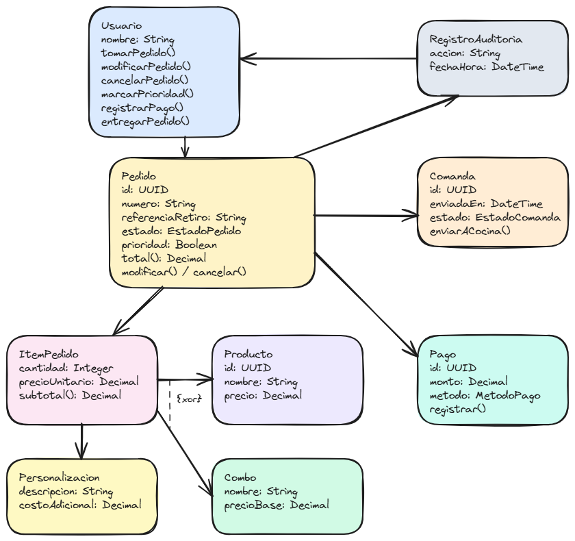

# Introducción

## 1. Descripción del paradigma orientado a objetos
El paradigma orientado a objetos organiza el sistema mediante objetos que representan entidades del dominio y combinan sus datos con las operaciones que pueden realizar. En este proyecto, conceptos como clientes, pedidos, productos, pagos y usuarios pueden modelarse como clases con atributos y métodos propios.

Este enfoque permite mantener cada responsabilidad encapsulada, reutilizar comportamientos mediante herencia cuando sea necesario y aplicar polimorfismo para que distintos objetos respondan de forma particular a una misma operación. De esta manera, el sistema de pedidos puede ser más modular, fácil de mantener y flexible para incorporar nuevas funcionalidades.

## 2. Los cuatro fundamentos de POO

### Abstracción
Consiste en representar únicamente las características y comportamientos relevantes de una entidad, ocultando los detalles innecesarios. Por ejemplo, la clase Pedido puede mostrar su número, estado y total, sin exponer cómo se calcula cada valor internamente.

### Encapsulamiento
Permite proteger los datos internos de un objeto y controlar su acceso mediante métodos. En el sistema, el estado de un pedido no debería modificarse directamente, sino a través de operaciones como confirmar(), cancelar() o cambiarEstado().

### Herencia
Permite crear nuevas clases a partir de otras existentes, reutilizando sus atributos y comportamientos. Por ejemplo, distintos tipos de usuario podrían compartir características de una clase Usuario y agregar funcionalidades específicas.

### Polimorfismo
Permite que objetos de diferentes clases respondan de manera particular a una misma operación. Por ejemplo, distintos medios de pago podrían implementar el método procesarPago() según sus propias reglas.

## 3. Requisitos iniciales del sistema

### 3.1 Requisitos funcionales
- RF1: toma de pedidos con personalizaciones y combos.
- RF2: envío automático de comandas a la cocina.
- RF3: seguimiento y visualización del estado del pedido.
- RF4: modificación de pedidos activos antes de la preparación.
- RF5: cancelación completa del pedido.
- RF6: identificación del pedido para el retiro.
- RF7: priorización manual.
- RF8: registro de pago.

### 3.2 Requisitos no funcionales
- RNF1: el sistema debe permitir incorporar nuevos locales en el futuro.
- RNF2: simplicidad operativa y facilidad de uso.
- RNF3: restricción de tiempo de entrega.
- RNF4: integridad de datos y consistencia del estado.
- RNF5: seguridad y trazabilidad de operaciones.

## 4. Alcance del MVP
El MVP incluye la gestión básica de pedidos, la comunicación con cocina, la visualización del estado, la actualización de órdenes activas, la cancelación, la identificación para retiro y el registro del pago. Se prioriza una solución simple, funcional y rápida de implementar en el tiempo disponible.

## 5. Casos de uso principales

### CU1 – Tomar Pedido
**Actor(es):** Usuario de mostrador

**Descripción breve:** El usuario registra un pedido con productos, cantidades y personalizaciones; el sistema calcula el total y lo envía automáticamente a cocina.

**Flujo principal de eventos:**
1. El usuario inicia un nuevo pedido en el sistema.
2. El sistema genera un número de pedido y solicita una referencia de retiro.
3. El usuario agrega productos o combos con sus cantidades y personalizaciones.
4. El sistema calcula el precio de cada ítem y el total del pedido.
5. El usuario confirma el pedido.
6. El sistema fija el estado como Recibido y envía la comanda a cocina.

**Precondiciones:**
- El local está operativo.
- El usuario está autenticado.

**Postcondiciones:**
- El pedido queda registrado con un número único, lista de ítems, total y estado Recibido.
- Cocina recibe la comanda sin intervención manual adicional.

### CU2 – Modificar Pedido
**Actor(es):** Usuario de mostrador

**Descripción breve:** El usuario corrige un pedido ya tomado, agregando, quitando o cambiando ítems o personalizaciones, siempre que cocina todavía no haya comenzado a prepararlo.

**Flujo principal de eventos:**
1. El usuario selecciona un pedido existente.
2. El sistema valida que el pedido esté en estado Recibido.
3. El usuario modifica ítems y/o personalizaciones.
4. El sistema recalcula el total del pedido.
5. Si ya existe un pago registrado, se registra la diferencia a cobrar.
6. El sistema conserva el mismo número de pedido.

**Precondiciones:**
- El pedido existe.
- El pedido está en estado Recibido.

**Postcondiciones:**
- El pedido queda actualizado con el total recalculado.
- El pedido en estado En preparación o posterior rechaza cualquier intento de modificación.

### CU3 – Cambiar Estado del Pedido
**Actor(es):** Cocina

**Descripción breve:** Cocina informa el avance del pedido y el sistema actualiza el estado respetando las transiciones válidas del ciclo de vida.

**Flujo principal de eventos:**
1. Cocina consulta la lista de pedidos pendientes.
2. Cocina indica que un pedido empezó a prepararse.
3. El sistema valida la transición Recibido → En preparación.
4. Cocina marca el pedido como terminado.
5. El sistema valida la transición En preparación → Listo.
6. El sistema bloquea modificaciones a partir de ese punto.

**Precondiciones:**
- El pedido existe.
- La transición solicitada es válida.

**Postcondiciones:**
- El pedido queda en un único estado consistente y visible para todo el negocio.

### CU4 – Cancelar Pedido
**Actor(es):** Usuario de mostrador

**Descripción breve:** El pedido se cancela sin eliminar su registro histórico, siempre que todavía no esté en estado Listo.

**Flujo principal de eventos:**
1. El usuario selecciona el pedido a cancelar.
2. El sistema verifica el estado actual.
3. El sistema autoriza la cancelación solo si el pedido está en Recibido o En preparación.
4. El sistema cambia el estado a Cancelado.
5. El sistema conserva el registro para auditoría.

**Precondiciones:**
- El pedido está en estado Recibido o En preparación.

**Postcondiciones:**
- El pedido queda en estado Cancelado.
- El pedido no vuelve a estado activo ni de preparación.

### CU5 – Entregar Pedido
**Actor(es):** Usuario de mostrador

**Descripción breve:** El usuario identifica el pedido por número o nombre de retiro y lo entrega al cliente, marcando la operación como finalizada.

**Flujo principal de eventos:**
1. El cliente se presenta en el mostrador.
2. El usuario busca el pedido por número o referencia de retiro.
3. El sistema confirma que el pedido está Listo.
4. El usuario entrega el pedido físicamente.
5. El sistema marca el pedido como Entregado.

**Precondiciones:**
- El pedido existe.
- El estado actual es Listo.

**Postcondiciones:**
- El pedido queda en estado Entregado de forma definitiva.
- El pedido ya no admite modificación ni cancelación.

## 6. Regla de negocio central
Un pedido solo puede cambiar de estado siguiendo una secuencia válida:
- Recibido → En preparación → Listo → Entregado
- Recibido → Cancelado
- En preparación → Cancelado
- Listo → no admite cancelación
- Entregado → no modificable ni cancelable

## 7. Modelo de dominio inicial

El modelo inicial contempla Usuario, Pedido, ItemPedido, Producto, Combo, Personalizacion, Comanda, Pago, RegistroAuditoria y EstadoPedido, junto con sus relaciones y enumeraciones de estado.

La fuente editable está en [01-boceto-inicial.excalidraw](../diagramas/01-diagrama-clases/01-boceto-inicial.excalidraw).

## 8. Arquitectura sugerida
Se recomienda una separación por capas:
- capa de dominio: entidades y reglas del negocio,
- capa de aplicación: lógica de casos de uso,
- capa de infraestructura: persistencia y auditoría,
- capa de presentación: interfaz para mostrador y cocina.

## 9. Conclusión
El proyecto se enmarca en una solución orientada a objetos con alta claridad funcional y poca complejidad operacional. El enfoque del MVP está orientado a cubrir las necesidades críticas del negocio sin perder la posibilidad de ampliar el sistema en futuras etapas.
